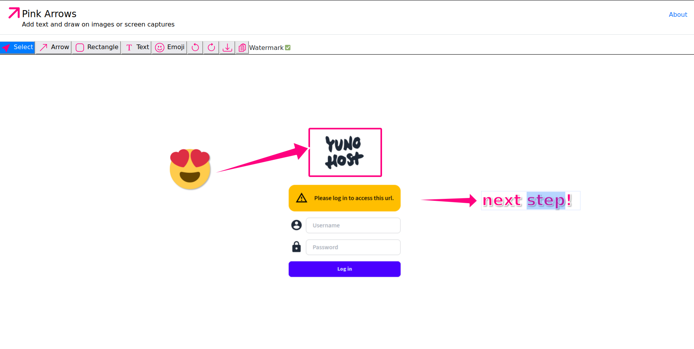

<!--
Este archivo README esta generado automaticamente<https://github.com/YunoHost/apps/tree/master/tools/readme_generator>
No se debe editar a mano.
-->

# Pink Arrows para Yunohost

[](https://dash.yunohost.org/appci/app/pinkarrows_ynh)  

[](https://install-app.yunohost.org/?app=pinkarrows_ynh)

*[Leer este README en otros idiomas.](./ALL_README.md)*

> *Este paquete le permite instalarPink Arrows rapidamente y simplement en un servidor YunoHost.*  
> *Si no tiene YunoHost, visita [the guide](https://yunohost.org/install) para aprender como instalarla.*

## Descripción general

Lightweight and intuitive app that enables annotating images or screen captures with text and drawings.

It runs in-browser and does not store any user data on the server (apart from the access log as per your YNH configuration).


**Versión actual:** 1.0~ynh1

**Demo:** <https://pinkarrows.app>

## Capturas



## Documentaciones y recursos

- Repositorio del código fuente oficial de la aplicación : <https://github.com/robbalian/pinkarrows>
- Catálogo YunoHost: <https://apps.yunohost.org/app/pinkarrows_ynh>
- Reportar un error: <https://github.com/YunoHost-Apps/pinkarrows_ynh_ynh/issues>

## Información para desarrolladores

Por favor enviar sus correcciones a la [`branch testing`](https://github.com/YunoHost-Apps/pinkarrows_ynh_ynh/tree/testing

Para probar la rama `testing`, sigue asÍ:

```bash
sudo yunohost app install https://github.com/YunoHost-Apps/pinkarrows_ynh_ynh/tree/testing --debug
o
sudo yunohost app upgrade pinkarrows_ynh -u https://github.com/YunoHost-Apps/pinkarrows_ynh_ynh/tree/testing --debug
```

**Mas informaciones sobre el empaquetado de aplicaciones:** <https://yunohost.org/packaging_apps>
