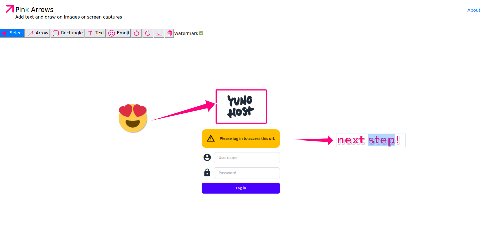

<!--
NOTA: Este README foi creado automáticamente por <https://github.com/YunoHost/apps/tree/master/tools/readme_generator>
NON debe editarse manualmente.
-->

# Pink Arrows para YunoHost

[](https://ci-apps.yunohost.org/ci/apps/pinkarrows/)


[](https://install-app.yunohost.org/?app=pinkarrows)

*[Le este README en outros idiomas.](./ALL_README.md)*

> *Este paquete permíteche instalar Pink Arrows de xeito rápido e doado nun servidor YunoHost.*  
> *Se non usas YunoHost, le a [documentación](https://yunohost.org/install) para saber como instalalo.*

## Vista xeral

Lightweight and intuitive app that enables annotating images or screen captures with text and drawings.

It runs in-browser and does not store any user data on the server (apart from the access log as per your YNH configuration).


**Versión proporcionada:** 2024.11.19~ynh1

**Demo:** <https://pinkarrows.app>

## Capturas de pantalla



## Documentación e recursos

- Repositorio de orixe do código: <https://github.com/robbalian/pinkarrows>
- Tenda YunoHost: <https://apps.yunohost.org/app/pinkarrows>
- Informar dun problema: <https://github.com/YunoHost-Apps/pinkarrows_ynh/issues>

## Info de desenvolvemento

Envía a túa colaboración á [rama `testing`](https://github.com/YunoHost-Apps/pinkarrows_ynh/tree/testing).

Para probar a rama `testing`, procede deste xeito:

```bash
sudo yunohost app install https://github.com/YunoHost-Apps/pinkarrows_ynh/tree/testing --debug
ou
sudo yunohost app upgrade pinkarrows -u https://github.com/YunoHost-Apps/pinkarrows_ynh/tree/testing --debug
```

**Máis info sobre o empaquetado da app:** <https://yunohost.org/packaging_apps>
